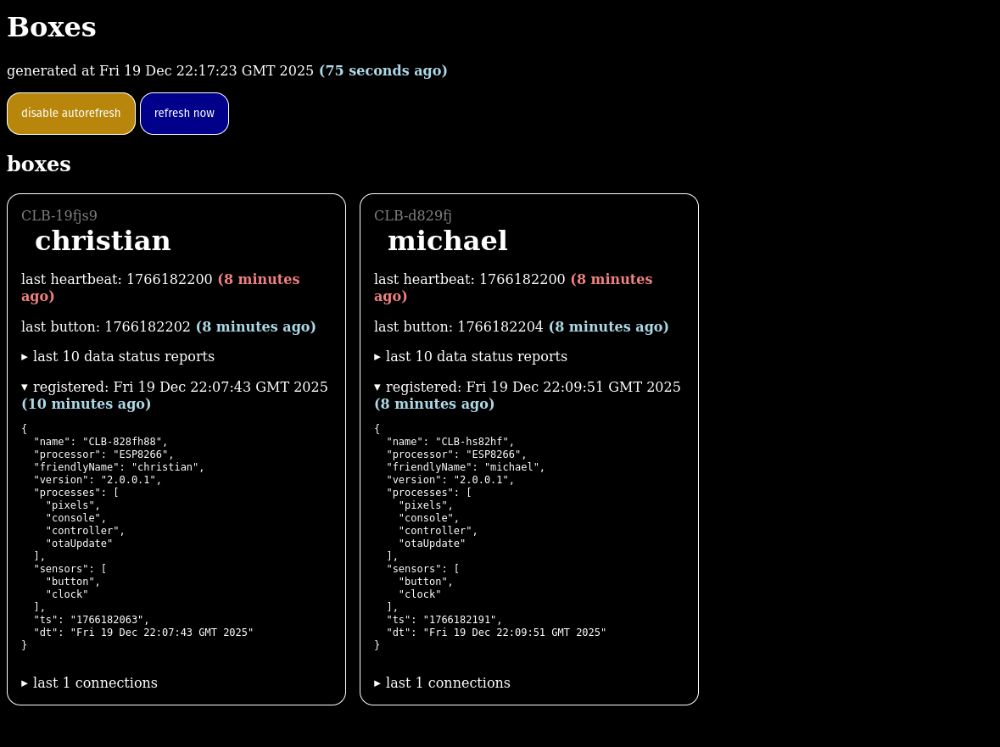

# Box Server

Listen for [ConnectedLittleBoxes](https://www.connectedlittleboxes.com/) and respond to commands. Also display a nice HTML page to see the state of the system.



You need an MQTT server set up to use this.

## Box setup

Boxes should be programmed with [CLB box code](https://github.com/connected-little-boxes/box-code).

First, give each box a unique `friendlyName`:

```clb
friendlyname=michael
```

Then, set the following configuration options, where `<wifissid>` etc. are replaced by real values

```clb
wifissid1=<wifissid>
wifipwd1=<wifipwd>
mqtthost=<mqtthost>
mqttuser=<mqttuser>
mqttpwd=<mqttpass>
pushbuttonfitted=yes
buttoninputpin=4
buttoninputgroundpin=5
pixelbrightness=0.2
{"process":"pixels","command":"pattern","pattern":"mask","colourmask":"GGGRRRRRRRRR","store":"start","id":"1of12"}
{"process":"pixels","command":"pattern","pattern":"mask","colourmask":"GGGGGGRRRRRR","store":"wifi","id":"2of12"}
{"process":"pixels","command":"pattern","pattern":"mask","colourmask":"GGGGGGGGGRRR","store":"clock","id":"3of12"}
{"process":"pixels","command":"pattern","pattern":"mask","colourmask":"GGGGGGGGGGGG","store":"mqtt","id":"4of12"}
{"process":"pixels","command":"pattern","pattern":"mask","colourmask":"GRRRRRRRRRRR","store":"wifioff","id":"1of12_2"}
timer1=1
timer1enabled=yes
timer1singleshot=no
{"process":"console","command":"remote","commandtext":"hrtbt","sensor":"clock","trigger":"timer1","to":"SERVER","store":"mqtt","id":"heartbeat"}
{"process":"pixels","command":"setnamedcolour","colourname":"purple","sensor":"button","trigger":"released","store":"mqtt","id":"buttoncol"}
{"process":"console","command":"remote","commandtext":"btn","sensor":"button","trigger":"released","to":"SERVER","store":"mqtt","id":"buttonrmt"}
```

## Server Setup

```bash
# clone
mkdir -p /usr/alifeee/
git clone git@github.com:alifeee/box-server.git /usr/alifeee/box-server
cd /usr/alifeee/box-server

# set up frontend
# assumes you have fastcgi set up to run scripts in /var/www/cgi/do/
sudo ln -s /usr/alifeee/box-server/cgi.sh /var/www/cgi/do/boxes

# set up listener
sudo apt install jq mosquitto-clients
mkdir -p registrations connections heartbeats buttons data

# set up ownership
sudo useradd -r -s /bin/false connectedlittleboxes
sudo chgrp -R connectedlittleboxes .
sudo chmod -R g+w .

# run (debug)
./run.sh

# run as a service
sudo cp box-server.service /etc/systemd/system
sudo systemctl enable box-server.service
sudo systemctl start box-server.service
sudo systemctl status box-server.service
```
